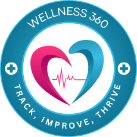

# WELLNESS 360

|  |  |
|------------------------------------------|------------------------------------------|

## Project Overview

This project analyzes various health reports, such as blood glucose, CRP, FBC, lipid panel, liver function, and thyroid function. It uses **Ballerina** for the backend and **React.js** for the frontend. Key features include user authentication, profile management, and cloud report upload functionality.

## Prerequisites

- [Node.js](https://nodejs.org/) (for frontend)
- [Ballerina](https://ballerina.io/) (for backend)
- MySQL Database (Aiven.io or local setup)
- Java KeyStore and related files for encryption

## Project Structure

### Backend

The backend is built using **Ballerina** and contains the following modules:

- `bloodGlucoseAnalysis`
- `crpAnalysis`
- `fbcAnalysis`
- `lipidPanelAnalysis`
- `liverFunctionTestAnalysis`
- `thyroidFunctionTestAnalysis`

### Frontend

The frontend is built with **React.js** and includes pages for user login, report analysis, and health tips for maintaining well-being.

## Setup Instructions

### 1. Clone the Repository

```bash
git clone https://github.com/InduwaraRathnayake/iwb121-code-stormers.git
cd iwb121-code-stormers
```

### 2. Backend Setup

#### Step 1: Install Ballerina

If you haven't installed Ballerina yet, [download and install it](https://ballerina.io/downloads/).

#### Step 2: Setup MySQL Database and Configure Backend

Create a `Config.toml` file in the backend folder and configure the database:

```markdown
📦backend
 ┣ 📂modules
 ┣ 📂resources
 ┣ 📜.devcontainer.json
 ┣ 📜.gitignore
 ┣ 📜api.bal
 ┣ 📜auth.bal
 ┣ 📜Ballerina.toml
 ┣ `📜Config.toml`
 ┣ 📜dbModels.bal
 ┣ 📜Dependencies.toml
 ┣ 📜models.bal
 ┣ 📜request.http
 ┗ 📜schema.sql
```

##### 1. Online Database on Aiven.io

```toml
[databaseConfig]
host ="mysql-2c283d8b-wellness-360.l.aivencloud.com"
user= "avnadmin"
password="AVNS_X8HnFao5MMcXB5Pg9cn"
database="wellness"
port=24836
```

##### 2. Local Database

- Create a MySQL database and execute the `schema.sql` file located in the backend folder to set up the necessary tables.
- Modify the `Config.toml` file to add your local database configurations:

```toml
[databaseConfig]
host = "localhost"
user = "root"
password = "your_local_password"
database = "wellness"
port = 3306
```

#### Step 3: Start the Backend

Navigate to the `backend` folder and run:

```bash
bal run
```

This will start the backend server with all health report analysis endpoints and authentication functionality.

### 3. Frontend Setup

#### Step 1: Install Node.js Dependencies

Navigate to the `frontend` folder and install dependencies:

```bash
cd frontend
npm install
```

#### Step 2: Start Frontend

Once the dependencies are installed, start the frontend development server:

```bash
npm run dev
```

This will start the **React.js** app on `localhost:5173` (by default).

### 4. Running Tests

To run backend tests for each module, navigate to the `backend` folder and use:

```bash
bal test
```

### 5. API

Refer to `api.bal` for REST API details on CRUD operations for user data, health report analysis, and authentication.

### 6. Key Features

- **User authentication** with RSA encryption and JWT
- Multiple **health report analyses**: blood glucose, CRP, FBC, lipid panel, liver function, and thyroid function
- **Generated report download** functionality
- Responsive frontend UI built with **React.js**, **Tailwind CSS**, and **Material UI**

### 7. Additional Notes

- Ensure that your `Ballerina.toml` and `Config.toml` files are properly configured with database, keystore, and other configurations.
- Use `request.http` for testing API requests in **VS Code**.
  
## Team Members

This project was developed by the following team members:

- [PathumiRanasinghe](https://github.com/PathumiRanasinghe)
- [SanujiSamarakoon](https://github.com/sanujis)
- [ShanthishaShyamana](https://github.com/ShanthishaShyamana)

## Contributing

Pull requests are welcome. For major changes, please open an issue first to discuss what you would like to change.

## License

[MIT](LICENSE)
